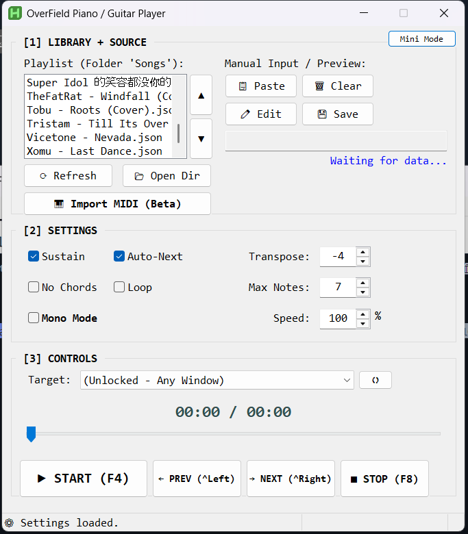

<div align="center">

# 🎹 OverField Music Player (OverField 自动乐器演奏工具)

**适用于《OverField》的高精度自动钢琴/吉他演奏脚本**

[](https://www.autohotkey.com/)
[](https://www.microsoft.com/windows)
[](../LICENSE)

<br>

[ **🇺🇸 English** ](../README.md) &nbsp;|&nbsp; [ **🇻🇳 Tiếng Việt** ](README_vi.md) &nbsp;|&nbsp; [ **🇨🇳 简体中文** ](README_zh.md) &nbsp;|&nbsp; [ **🇯🇵 日本語** ](README_ja.md) &nbsp;|&nbsp; [ **🇮🇩 Bahasa Indonesia** ](README_id.md)

<br>

<br>



</div>

> [!NOTE] > **⚠️ 游戏版本提示** > **乐器家具**演奏功能目前**仅在《OverField》 (开放空间) 国服**开放。
> 下载地址: [哔哩哔哩游戏中心](https://www.biligame.com/detail/?id=114015&spm_id_from=555.224.0.0&sourceFrom=1600820011)

---

## 📖 目录

- [简介](#-简介)
- [主要功能](#-主要功能)
- [安装指南](#-安装指南)
- [使用说明](#-使用说明)
- [按键与控制](#-按键与控制)
- [设置与配置](#-设置与配置)
- [歌曲格式](#-歌曲格式)
- [参与贡献](#-参与贡献)

---

## 🌟 简介

**OverField Music Player** 是一款专为游戏 _OverField_ 设计的高精度自动化脚本，完美支持 **钢琴** 和 **电吉他**（它们拥有相同的按键布局）。基于 **AutoHotkey v2** 开发，它在 MIDI 编曲和游戏内演奏之间架起了一座桥梁，提供毫秒级精度的计时和丰富的实时控制功能。

> [!TIP] > **觉得好用吗？** 请在 GitHub 上为本项目点一颗 ⭐ **Star** 以支持开发！

## ✨ 主要功能

| 功能            | 描述                                                                            |
| :-------------- | :------------------------------------------------------------------------------ |
| **🎯 精准计时** | 使用 `timeBeginPeriod(1)` 和混合等待循环，确保音符执行的精准度。                |
| **📂 音乐库**   | 内置播放列表管理器，可以直接管理、排序和加载 `.json` 格式的歌曲文件。           |
| **🎛️ 实时控制** | 在演奏过程中实时调整 **速度 (10-500%)**、**移调 (Transpose)** 和 **进度跳转**。 |
| **🧠 智能逻辑** | **自动暂停**：切出游戏时自动暂停；**优化模式**：针对复杂歌曲自动优化性能。      |
| **🎹 高级模式** | 支持 **延音 (Sustain)** 和 **单声道模式 (Mono Mode)**，让旋律更纯净。           |

## 🚀 安装指南

1.  **安装 AutoHotkey v2**: 请访问 [autohotkey.com](https://www.autohotkey.com/) 下载并安装。
2.  **下载脚本**: 克隆本仓库或直接下载源代码。
3.  **准备目录**: 确保 `script.ahk` 同级目录下有 `Songs` 文件夹（如果没有，脚本会自动创建）。
4.  **添加音乐**: 将转换好的 `.json` 歌曲文件放入 `Songs` 文件夹。

## 🎮 使用说明

1.  运行 `script.ahk` (右键 -> Run Script)。
2.  在左侧 **Library (音乐库)** 列表中选择一首歌曲。
3.  在下拉菜单中选择 **Target Window (目标窗口)**（即游戏窗口）。
4.  点击 **Start** 按钮或按下 **F4** 键开始演奏。

> [!TIP]
> 建议先选择 `(Unlocked - Any Window)` 模式在记事本中进行测试，熟悉操作后再进入游戏！

## 🎹 按键与控制

### 快捷键

|       按键       | 功能                  |
| :--------------: | :-------------------- |
|      **F4**      | **播放 / 暂停** 切换  |
| **Ctrl + Left**  | **上一首** (Previous) |
| **Ctrl + Right** | **下一首** (Next)     |
|      **F8**      | **立即停止**          |

### 界面控制

- **进度条**: 拖动滑块即可跳转到歌曲的任意位置。
- **控制**: 使用 **Prev / Next** 按钮快速切换歌曲。
- **速度**: 输入百分比（例如 `120` 代表 1.2 倍速）或使用上下箭头微调。
- **播放列表**: 使用 ▲ / ▼ 按钮调整歌曲顺序。

## ⚙️ 设置与配置

所有设置会自动保存到 `config.ini` 文件中：

- **Sustain (延音)**: 根据音符时长自动长按按键。
- **No Chords (无和弦)**: 忽略低音区的和弦按键（z, x, c...），适合单人演奏。
- **Mono Mode (单音模式)**: 同一时间只演奏一个音符（高音优先）。
- **Max Polyphony (最大复音数)**: 限制同时按下的按键数量，防止被游戏屏蔽或卡顿。

## 📁 歌曲格式

本脚本能够读取特定结构的 JSON 文件：

<details>
<summary>点击查看 JSON 示例</summary>

```json
{
  "tracks": [
    {
      "instrument": { "family": "piano" },
      "notes": [
        {
          "time": 0.0,
          "duration": 0.5,
          "midi": 60
        }
      ]
    }
  ]
}
```

</details>

### 如何将 MIDI 转换为 JSON

由于本工具使用特定的 JSON 格式，您可以使用 **Tone.js MIDI** 工具来转换您的 `.mid` 文件：

1.  访问 [https://tonejs.github.io/Midi/](https://tonejs.github.io/Midi/).
2.  将您的 MIDI 文件拖放到该页面。
3.  复制生成的 JSON 输出。
4.  将其粘贴到 `Songs` 文件夹中的新文件（例如 `mysong.json`）。

> [!TIP] > **寻找 MIDI 文件？** 您可以在 [OnlineSequencer.net](https://onlinesequencer.net/sequences) 找到高质量的 MIDI 序列。

> [!IMPORTANT] > **🎹 MIDI 选择指南**
> 游戏内的乐器仅限于 **21 个全音阶按键**（3 个八度的白键）和 **7 个和弦按键**。
>
> - **旋律范围**: C3 - B5（仅限白键）。
> - **和弦范围**: C2 - B2。
> - **提示**: 为了获得最佳效果，请选择旋律简单（升降号较少）的歌曲，或在转换前将 MIDI 移调至 **C 大调 (C Major)** 或 **A 小调 (A Minor)**。

## 📝 待办事项 / 路线图

- [ ] **直接支持 MIDI**: 无需转换，直接读取 `.mid` 文件。
- [ ] **自定义键位**: 允许用户在界面上自定义 MIDI 音符到键盘按键的映射。
- [ ] **主题支持**: 增加深色模式和自定义配色。
- [ ] **可视化覆盖层**: 在屏幕上显示虚拟键盘，实时高亮正在按下的键。
- [ ] **宏录制**: 录制游戏内的演奏并保存为文件。
- [x] **迷你模式**: 紧凑的界面，提供更好的视野。

## 🤝 参与贡献

欢迎任何形式的贡献！如果你有好的想法、Bug 修复或新功能（比如更好的 MIDI 解析算法！），请随时：

1.  **Fork** 本仓库。
2.  创建你的特性分支 (Feature branch)。
3.  提交你的改动 (Commit)。
4.  发起 **Pull Request (PR)**。

---

## 📞 联系与支持

如有任何疑问或想加入讨论，请通过以下方式联系我：

[](https://discord.gg/w4pE2uHm)
[](https://www.facebook.com/carlyle.katto.1210)

---

<div align="center">
  <i>Created with ❤️ for the OverField Community</i>
</div>
